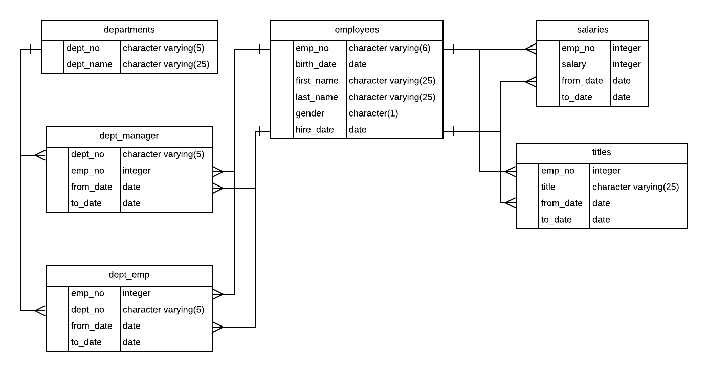

# Employee-database
Inspected the CSVs and sketched out an ERD of the tables.

Data Engineering side of things

Used the information found to create a table schema for each of the six CSV files.
Imported each CSV file into a corresponding SQL table.

Data Analysis side of things

Listed the details of each employee: employee number, last name, first name, gender, and salary.
Found employees who were hired in 1986.
Listed the manager of each department using: department number, department name, the manager's employee number, last name, first name, and start and end employment dates.
Listed the department of each employee using: employee number, last name, first name, and department name.
Listed all employees whose first name was "Hercules" and last names began with "B."
Listed all employees in the Sales department, including their employee number, last name, first name, and department name.
Joined all employees in the Sales and Development departments, using their employee number, last name, first name, and department name.
In descending order, listed the frequency count of employee last names, i.e., how many employees share each last name.

